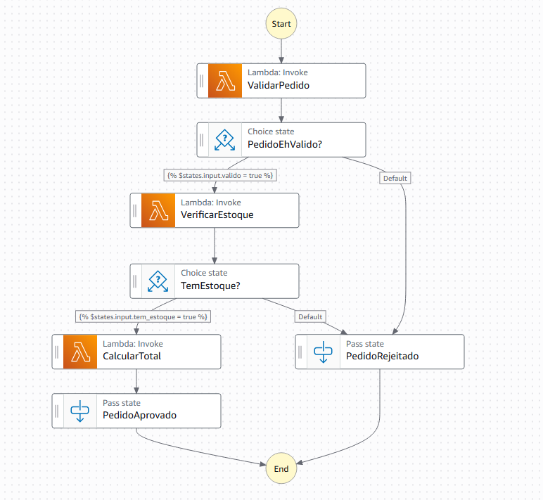

# Lab: Step Functions — Fluxo de Aprovação de Pedido

## 📋 Descrição

Este lab apresenta o **AWS Step Functions**, um serviço que permite orquestrar múltiplos serviços AWS em um fluxo visual de etapas. Em vez de uma Lambda gigante com toda a lógica, cada responsabilidade vira um estado separado — fácil de entender, testar e manter.

O cenário é um **fluxo de aprovação de pedido** com três etapas encadeadas e dois caminhos possíveis (aprovado ou rejeitado).

---

## 🏗️ Arquitetura

### Visão Geral

Este lab implementa um fluxo de aprovação de pedidos usando **AWS Step Functions** para orquestrar três funções Lambda em um workflow visual e gerenciável.



```
┌─────────────────────────────────────────────────────────────────────┐
│                        STATE MACHINE                                │
│                   fluxo-aprovacao-pedido                            │
├─────────────────────────────────────────────────────────────────────┤
│                                                                     │
│  📥 Input                                                           │
│  { cliente, produto, quantidade, preco_unitario }                   │
│                           │                                         │
│                           ▼                                         │
│                  ┌─────────────────┐                                │
│                  │ ValidarPedido   │  ◄─── Lambda 1                │
│                  │   (Task/Lambda) │                                │
│                  └────────┬────────┘                                │
│                           │                                         │
│                           ▼                                         │
│                  ┌─────────────────┐                                │
│                  │ PedidoEhValido? │                                │
│                  │    (Choice)     │                                │
│                  └────┬────────┬───┘                                │
│                  ✅   │        │  ❌                                │
│                       │        └──────────────────┐                 │
│                       ▼                           │                 │
│              ┌─────────────────┐                  │                 │
│              │VerificarEstoque │  ◄─── Lambda 2   │                 │
│              │  (Task/Lambda)  │                  │                 │
│              └────────┬────────┘                  │                 │
│                       │                           │                 │
│                       ▼                           │                 │
│              ┌─────────────────┐                  │                 │
│              │  TemEstoque?    │                  │                 │
│              │    (Choice)     │                  │                 │
│              └────┬────────┬───┘                  │                 │
│              ✅   │        │  ❌                  │                 │
│                   │        └──────────┐           │                 │
│                   ▼                   │           │                 │
│          ┌─────────────────┐          │           │                 │
│          │  CalcularTotal  │  ◄─── Lambda 3       │                 │
│          │  (Task/Lambda)  │          │           │                 │
│          └────────┬────────┘          │           │                 │
│                   │                   │           │                 │
│                   ▼                   ▼           ▼                 │
│          ┌─────────────────┐   ┌──────────────────────┐            │
│          │ PedidoAprovado  │   │  PedidoRejeitado     │            │
│          │   (Pass) ✅     │   │     (Pass) ❌        │            │
│          └─────────────────┘   └──────────────────────┘            │
│                   │                        │                        │
│                   ▼                        ▼                        │
│  📤 Output: { status: "APROVADO",  status: "REJEITADO",            │
│               total: 20250.00,      motivo: "..." }                 │
│               desconto: 10% }                                       │
└─────────────────────────────────────────────────────────────────────┘
```

### Componentes da Arquitetura

#### 🔹 State Machine (Step Functions)
- **Nome:** `fluxo-aprovacao-pedido`
- **Linguagem:** Amazon States Language (ASL) com JSONata
- **Função:** Orquestra o fluxo completo de validação, verificação e cálculo

#### 🔹 Funções Lambda

| Lambda | Arquivo | Responsabilidade | Input | Output |
|--------|---------|------------------|-------|--------|
| **ValidarPedido** | `lambda_valida_pedido.py` | Valida campos obrigatórios e tipos de dados | Pedido completo | `{ valido: bool, motivo?: string }` |
| **VerificarEstoque** | `lambda_verifica_estoque.py` | Consulta estoque disponível do produto | `{ produto, quantidade }` | `{ tem_estoque: bool, disponivel: int }` |
| **CalcularTotal** | `lambda_calcula_total.py` | Calcula total com desconto progressivo | `{ quantidade, preco_unitario }` | `{ total: float, desconto: int }` |

#### 🔹 Estados da State Machine

| Estado | Tipo | Descrição | Próximo Estado |
|--------|------|-----------|----------------|
| **ValidarPedido** | Task | Invoca Lambda de validação | PedidoEhValido? |
| **PedidoEhValido?** | Choice | Verifica se `valido == true` | VerificarEstoque OU PedidoRejeitado |
| **VerificarEstoque** | Task | Invoca Lambda de estoque | TemEstoque? |
| **TemEstoque?** | Choice | Verifica se `tem_estoque == true` | CalcularTotal OU PedidoRejeitado |
| **CalcularTotal** | Task | Invoca Lambda de cálculo | PedidoAprovado |
| **PedidoAprovado** | Pass | Monta resposta de sucesso | (fim) |
| **PedidoRejeitado** | Pass | Monta resposta de erro | (fim) |

### Fluxo de Dados

#### ✅ Caminho de Sucesso
```
Input → ValidarPedido → VerificarEstoque → CalcularTotal → PedidoAprovado
```

**Exemplo:**
```json
Input:  { "cliente": "Ana", "produto": "Notebook", "quantidade": 5, "preco_unitario": 4500 }
Output: { "status": "APROVADO", "total": 20250.00, "desconto": 10 }
```

#### ❌ Caminhos de Rejeição

**Rejeição na Validação:**
```
Input → ValidarPedido → PedidoRejeitado
```

**Rejeição no Estoque:**
```
Input → ValidarPedido → VerificarEstoque → PedidoRejeitado
```

### Permissões IAM

#### Lambda Execution Role
- `AWSLambdaBasicExecutionRole` - CloudWatch Logs

#### Step Functions Execution Role
- `lambda:InvokeFunction` - Invocar as 3 Lambdas
- `logs:CreateLogGroup`, `logs:CreateLogStream`, `logs:PutLogEvents` - CloudWatch Logs

### Características Técnicas

- **Runtime:** Python 3.12
- **Timeout Lambda:** 30 segundos
- **Memória Lambda:** 256 MB
- **Região:** us-east-1
- **Linguagem de Query:** JSONata (substituiu JSONPath)
- **Retry:** Não configurado (pode ser adicionado por estado)
- **Catch:** Não configurado (pode ser adicionado para tratamento de erros)

### Vantagens desta Arquitetura

✅ **Visibilidade:** Cada execução gera um grafo visual no console AWS  
✅ **Manutenibilidade:** Cada Lambda tem uma responsabilidade única  
✅ **Testabilidade:** Lambdas podem ser testadas isoladamente  
✅ **Reusabilidade:** Lambdas podem ser usadas em outros fluxos  
✅ **Rastreabilidade:** Histórico completo de execuções com input/output de cada estado  
✅ **Escalabilidade:** Step Functions gerencia automaticamente a execução paralela

---

## 🔤 O que é JSONata?

A state machine usa **JSONata** como linguagem de query — é a forma moderna de transformar e acessar dados dentro dos estados do Step Functions (substituiu o JSONPath).

A sintaxe usa `` para expressões. Exemplos usados neste lab:

```jsonc
// Passar o input inteiro para a Lambda
"Payload": ""

// Acessar um campo específico
"cliente": ""

// Condição no estado Choice
"Condition": ""

// Concatenar strings
"mensagem": ""

// Operador ternário (se/senão)
"motivo": ""
```

---

## 🚀 Pré-requisitos

- AWS CLI configurado com credenciais válidas
- Permissões IAM para criar: Lambda, Step Functions, IAM
- Bash shell (Linux/Mac) ou Git Bash (Windows)

---

## 📦 Deploy

### 1. Criar os pacotes Lambda

Este lab tem **três Lambdas**, cada uma em um arquivo separado.

**Windows (PowerShell):**
```powershell
Compress-Archive -Path lambda_valida_pedido.py    -DestinationPath valida.zip   -Force
Compress-Archive -Path lambda_verifica_estoque.py -DestinationPath estoque.zip  -Force
Compress-Archive -Path lambda_calcula_total.py    -DestinationPath total.zip    -Force
```

**Linux/Mac:**
```bash
zip valida.zip   lambda_valida_pedido.py
zip estoque.zip  lambda_verifica_estoque.py
zip total.zip    lambda_calcula_total.py
```

### 2. Executar o deploy

```bash
chmod +x deploy.sh
./deploy.sh
```

O script cria todos os recursos em ordem:
- ✅ IAM Role para as Lambdas
- ✅ 3 funções Lambda
- ✅ IAM Role para a Step Functions (com permissão de invocar as Lambdas)
- ✅ State Machine `fluxo-aprovacao-pedido`

**Tempo estimado:** ~40 segundos

---

## 🧪 Testando o Lab

Copie o ARN da state machine exibido no final do deploy e use nos comandos abaixo.

### Teste 1 — Pedido aprovado com desconto (quantidade ≥ 5)

```bash
aws stepfunctions start-execution \
  --state-machine-arn ARN_DA_SUA_STATE_MACHINE \
  --input '{"cliente":"Ana Lima","produto":"Notebook","quantidade":5,"preco_unitario":4500.00}' \
  --region us-east-1
```

**Resultado esperado:** `APROVADO` com 10% de desconto → total R$ 20.250,00

### Teste 2 — Pedido aprovado sem desconto (quantidade < 5)

```bash
aws stepfunctions start-execution \
  --state-machine-arn ARN_DA_SUA_STATE_MACHINE \
  --input '{"cliente":"Carlos Souza","produto":"Mouse","quantidade":2,"preco_unitario":89.90}' \
  --region us-east-1
```

**Resultado esperado:** `APROVADO` sem desconto → total R$ 179,80

### Teste 3 — Pedido rejeitado por campo ausente

```bash
aws stepfunctions start-execution \
  --state-machine-arn ARN_DA_SUA_STATE_MACHINE \
  --input '{"cliente":"Beatriz","produto":"Teclado"}' \
  --region us-east-1
```

**Resultado esperado:** `REJEITADO` — campo obrigatório ausente: `quantidade`

### Teste 4 — Pedido rejeitado por falta de estoque

```bash
aws stepfunctions start-execution \
  --state-machine-arn ARN_DA_SUA_STATE_MACHINE \
  --input '{"cliente":"Diego","produto":"Monitor","quantidade":99,"preco_unitario":1800.00}' \
  --region us-east-1
```

**Resultado esperado:** `REJEITADO` — estoque insuficiente (Monitor tem apenas 5 unidades)

---

## 🔍 Verificando os Resultados

### 1. Ver o resultado de uma execução via CLI

O comando `start-execution` retorna um `executionArn`. Use-o para consultar o resultado:

```bash
aws stepfunctions describe-execution \
  --execution-arn ARN_DA_EXECUCAO \
  --region us-east-1
```

Procure o campo `"output"` na resposta — ele contém o JSON final com `status`, `cliente`, `total`, etc.

### 2. Visualizar o fluxo no Console AWS (recomendado para a aluna)

```
https://console.aws.amazon.com/states/home?region=us-east-1#/statemachines
```

1. Clique na state machine `fluxo-aprovacao-pedido`
2. Clique em uma execução
3. Veja o **grafo visual** com cada estado colorido (verde = passou, vermelho = falhou, cinza = não executou)
4. Clique em cada estado para ver o input e output

> 💡 O console visual é a melhor forma de entender o Step Functions. Incentive a aluna a explorar cada estado clicando neles.

### 3. Listar todas as execuções

```bash
aws stepfunctions list-executions \
  --state-machine-arn ARN_DA_SUA_STATE_MACHINE \
  --region us-east-1
```

---

## 📊 Regras de Negócio

### Desconto por quantidade

| Quantidade | Desconto |
|---|---|
| 1 a 4 unidades | Sem desconto |
| 5 a 9 unidades | 10% |
| 10 ou mais | 20% |

### Estoque simulado

| Produto | Estoque |
|---|---|
| Notebook | 10 |
| Mouse | 50 |
| Teclado | 30 |
| Monitor | 5 |
| Headset | 20 |
| Webcam | 15 |
| Outros | 8 |

---

## 🎯 Conceitos Aprendidos

- **AWS Step Functions**: orquestra múltiplos serviços em um fluxo visual de estados
- **State Machine**: a "receita" do fluxo — define os estados e as transições entre eles
- **Tipos de estado**:
  - `Task` — executa algo (uma Lambda, uma API, etc.)
  - `Choice` — toma uma decisão baseada nos dados
  - `Pass` — passa os dados adiante sem executar nada (útil para montar respostas)
- **JSONata**: linguagem de expressão para transformar e acessar dados entre os estados
- **Separação de responsabilidades**: cada Lambda faz uma coisa só — mais fácil de testar e reutilizar
- **Fluxo condicional**: o mesmo input pode seguir caminhos diferentes dependendo dos dados

---

## ❓ Por que usar Step Functions em vez de uma Lambda só?

Você poderia colocar toda a lógica (validar + verificar estoque + calcular) em uma única Lambda. Mas com Step Functions você ganha:

| Aspecto | Lambda única | Step Functions |
|---|---|---|
| Visibilidade | Log de texto | Grafo visual com cada passo |
| Depuração | Difícil rastrear onde falhou | Vê exatamente qual estado falhou |
| Reuso | Lógica acoplada | Cada Lambda pode ser reutilizada em outros fluxos |
| Retry automático | Você implementa | Configurável por estado |
| Fluxos longos | Timeout de 15 min | Até 1 ano de execução |

---

## 🧹 Limpeza

```bash
chmod +x cleanup.sh
./cleanup.sh
```

**⚠️ ATENÇÃO:** Todos os recursos serão apagados permanentemente.

---

## 📚 Documentação AWS

- [AWS Step Functions](https://docs.aws.amazon.com/step-functions/latest/dg/welcome.html)
- [JSONata no Step Functions](https://docs.aws.amazon.com/step-functions/latest/dg/transforming-data.html)
- [Tipos de estado](https://docs.aws.amazon.com/step-functions/latest/dg/concepts-amazon-states-language.html)
- [Step Functions + Lambda](https://docs.aws.amazon.com/step-functions/latest/dg/connect-lambda.html)
